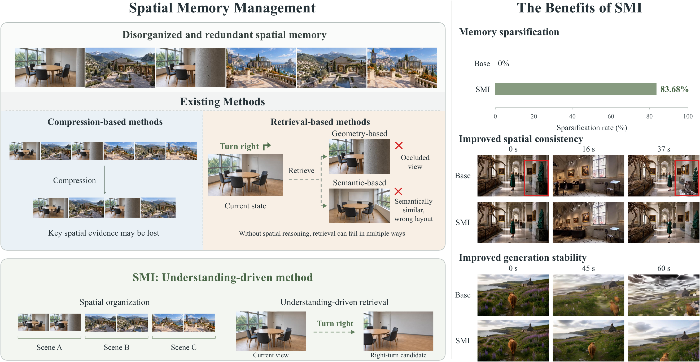
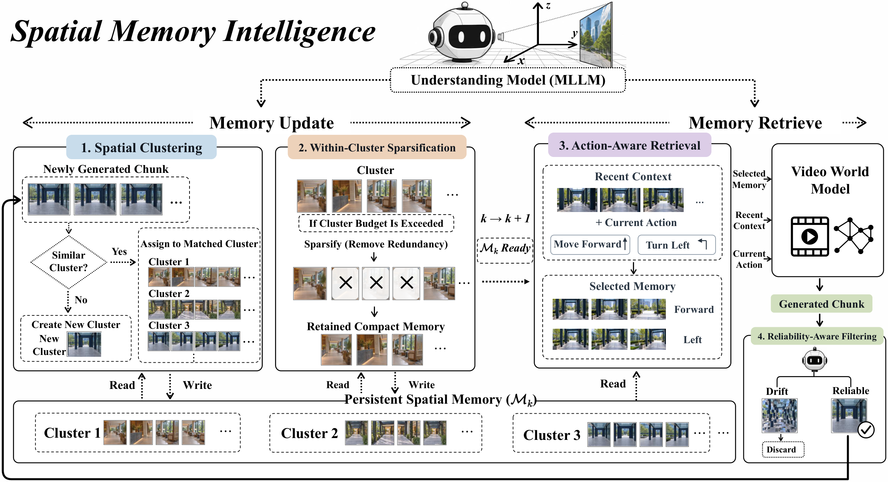

# Spatial Memory Intelligence (SMI)

### Endowing World Models with Understanding-Driven Long-Term Memory

[Project Website](https://spatial-memory-intelligence.github.io/) · [Video Comparisons](https://spatial-memory-intelligence.github.io/#demos) · [Method](https://spatial-memory-intelligence.github.io/#method)

## Overview

As historical memory grows, managing spatial memory becomes increasingly complex, requiring coordinated organization, maintenance, sparsification, and retrieval. This calls for a more intelligent and comprehensive memory-management approach.

**Spatial Memory Intelligence (SMI)** is the first understanding-driven unified spatial-memory manager for long-video world models. It uses a multimodal large language model (MLLM) to coordinate four atomic operations, bringing semantic and spatial reasoning into the memory-management pipeline.

Experiments across multiple baselines, benchmarks, and world-model backbones demonstrate improvements in **memory sparsity, spatial consistency, and generation stability**.

## Method

SMI maintains persistent spatial memory through four coordinated operations:

| Operation | Role in spatial-memory management |
| --- | --- |
| **Spatial clustering** | Group spatially related observations into coherent memory clusters. |
| **Within-cluster sparsification** | Remove redundant observations while retaining useful spatial evidence. |
| **Action-aware retrieval** | Select relevant memories using recent context and the next user action. |
| **Reliability-aware filtering** | Keep unreliable generated observations from entering persistent memory. |

Dedicated instructions and supervision teach the MLLM the semantic and spatial judgments required by each operation. Together, these operations support both memory updates and retrieval throughout long-horizon generation.

## Video Comparisons

The project website presents synchronized, side-by-side video comparisons, grouped by world-model backbone: **HY1.5** and **Wan2.2**.

Each example compares SMI with Base. Selected examples also include FramePack, Deep Forcing, MoC, VMem, and MemFlow. Dynamic red boxes highlight selected spatial and structural inconsistencies.

**[Explore the interactive comparisons →](https://spatial-memory-intelligence.github.io/#demos)**

## Release Status

This public repository currently provides the project overview and supporting figures in `File/`. Training, inference, and evaluation code is coming soon.

| Resource | Status |
| --- | --- |
| Project website and video demonstrations | [Available](https://spatial-memory-intelligence.github.io/) |
| Training, inference, and evaluation code | Coming soon |
| Paper | Link to be added |
| Model weights on Hugging Face | Link to be added |
| Dataset | Link to be added |

Installation requirements, runnable examples, and reproduction instructions will accompany the code release.

## Authors

[Ying Yang](https://github.com/xbyym)1,*, [Guiyu Zhang](https://grenoble-zhang.github.io/)1,2,*, [Lianghua Huang](https://github.com/huanglianghua)2, [Chang Nie](https://github.com/Clare-Nie)4, [Chenyang Si](https://chenyangsi.top/)4, [Haofan Wang](https://haofanwang.github.io/)5, [Shaoshuai Shi](https://shishaoshuai.com/)6, and [Li Jiang](https://llijiang.github.io/)1,3,†.

\* Equal contribution. † Corresponding author.

1 The Chinese University of Hong Kong, Shenzhen · 2 Alibaba Group · 3 Shenzhen Loop Area Institute · 4 Nanjing University · 5 Lovart AI · 6 Voyager Research, Didi Chuxing
